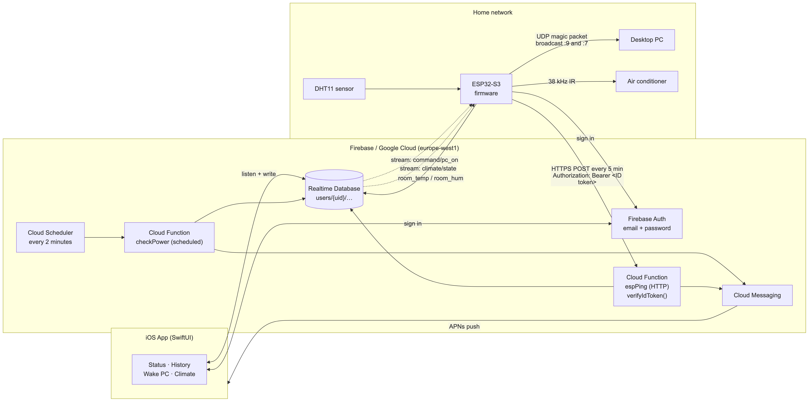
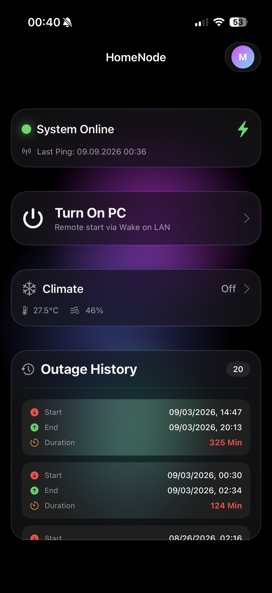
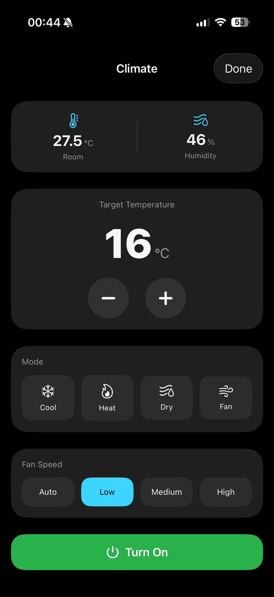
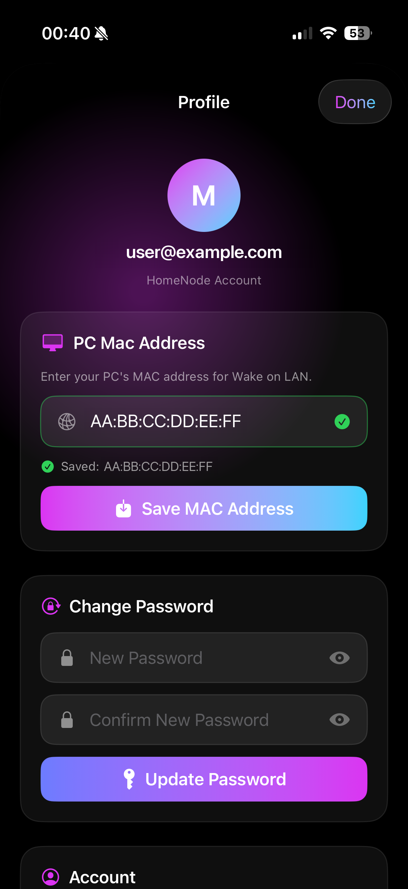

# Home Node

ESP32-based smart-home controller with power-outage monitoring, Firebase cloud
integration, iOS push notifications, Wake-on-LAN, and infrared appliance control.

## Overview

Home Node is an end-to-end IoT system built for a real apartment, not a demo. A
single ESP32-S3 on the home network acts as the bridge between the flat and the
cloud: it reports that mains power is still on, wakes a desktop PC over the LAN
on request, drives an air conditioner over infrared, and reports room
temperature and humidity. A SwiftUI iOS app is the control surface, and Firebase
(Realtime Database, Auth, Cloud Functions, Cloud Scheduler, Cloud Messaging) is
the glue between them.

The repository contains three codebases: the ESP32-S3 firmware (`esp/`), the
first-generation ESP32 firmware kept for reference (`esp32-legacy/`), the
Firebase Cloud Functions (`functions/`), and the iOS app (`HomeNode/`).

## Why I Built This

Home Node started with a problem I encountered while traveling abroad.

During the trip, a circuit breaker tripped at home. I had no way of knowing
that the apartment had lost power, and when I returned, I discovered that the
refrigerator had been without power long enough for everything inside to
spoil.

I wanted to make sure I would know if something similar happened again. The
interesting constraint was that the device monitoring the house would lose
power at the same time as everything else.

Instead of trying to report the outage itself, I designed the system around a
heartbeat. An ESP32 periodically reports that the house is online. If those
heartbeats stop arriving for long enough, the backend infers a possible power
outage and sends a notification to my phone. When the device comes back
online, the system records the recovery and outage duration.

Once I had a remotely connected device running at home, I started using it to
solve a few other problems I had while away.

I wanted to be able to turn on my desktop PC remotely, so I added Wake-on-LAN
control through the ESP32.

I also wanted to turn on the air conditioner before arriving home. Since the
AC is controlled by an infrared remote rather than a network interface, I
added an IR transmitter to the ESP32 and implemented remote temperature,
mode, fan-speed, and power control from the iOS app.

What began as a way to avoid another unnoticed power outage gradually became
a small home-control system connecting embedded hardware, cloud services,
networking, and a native iOS application.

## Features

- **Power-outage detection** — cloud-side timeout on a device heartbeat
- **Recovery detection** — the outage record is closed and its duration computed
  when the device comes back
- **iOS push notifications** on both outage and restore, via FCM
- **Outage history** — start, end and duration, persisted per user
- **Remote Wake-on-LAN** — wakes a desktop PC over the LAN from anywhere
- **Infrared air-conditioner control** — power, target temperature (16–30 °C),
  mode (cool / heat / dry / fan / auto) and fan speed (auto / low / medium /
  high)
- **Room temperature and humidity** from a DHT11, reported once a minute
- **Firebase email/password authentication**, with every database path scoped to
  the signed-in user's UID and the heartbeat endpoint verifying the caller's
  Firebase ID token server-side
- **LAN-only web UI** as a separate firmware build, for bench-testing IR without
  touching the cloud

## System Architecture

<div align="center">
  <picture>
    <source media="(prefers-color-scheme: dark)" srcset="docs/diagrams/system-architecture-dark.png">
    <source media="(prefers-color-scheme: light)" srcset="docs/diagrams/system-architecture-light.png">
    
  </picture>
</div>

### Realtime Database layout

Everything hangs off the authenticated user's UID:

```
users/{uid}/
  status/
    last_ping        # epoch ms, written by espPing
    power_available  # bool
    room_temp        # °C, from DHT11
    room_hum         # %, from DHT11
    ac_last_ping     # epoch ms, device liveness for the AC controller
  history/{pushId}/
    start, start_ts, end, end_ts, duration_min
  command/
    pc_on            # bool — set by the app, cleared by the device
  climate/state/
    power, temp, mode, fan, updated
  profile/
    mac_address      # target PC MAC, entered in the app
  fcm_token          # iOS device push token
```

## How It Works

### Power monitoring

Mains power is inferred from a heartbeat, because a device that has lost power
cannot report that it has lost power.

1. The ESP32 signs in to Firebase Auth with a dedicated account and POSTs to the
   `espPing` Cloud Function **every 5 minutes**, sending the ID token of that
   session as `Authorization: Bearer <token>`.
2. `espPing` verifies the token with the Admin SDK's `verifyIdToken()` and takes
   the UID **from the verified token**. Nothing in the request body or headers
   names a user, so a caller cannot write a heartbeat for anyone but itself.
   Verification is called with `checkRevoked`, so disabling the device's account
   in the Firebase console stops it being accepted.
3. `espPing` writes `status/last_ping` and sets `status/power_available = true`.
4. Cloud Scheduler triggers the `checkPower` function **every 2 minutes**. It
   walks every user and compares `now - last_ping` against a **10-minute**
   threshold. Crossing it — while `power_available` is still `true` — is what
   defines an outage.
5. On detection, `checkPower` sets `power_available = false`, pushes a new
   `history` entry stamped with the *last successful ping* (not the detection
   time), and sends an FCM notification.
6. Recovery is detected inside `espPing`: when a ping arrives and the previous
   `power_available` was `false`, the function finds the most recent history
   entry with `end_ts == 0`, fills in the end timestamp and the duration in
   minutes, and sends a "power restored" notification.

The 5-minute heartbeat against a 10-minute threshold means a single dropped ping
does not raise a false alarm, and detection latency is bounded at roughly 10–12
minutes.

### Wake-on-LAN

1. The user taps **Turn On PC**. The app writes `command/pc_on = false` and then
   `true` — the deliberate false-then-true toggle guarantees the device's stream
   fires even if the flag was left set.
2. The ESP32 holds an open RTDB stream on `command/pc_on`. The stream callback
   only sets a volatile flag; all Firebase I/O happens back in the main loop,
   because reusing a streaming `FirebaseData` object for other calls corrupts the
   stream.
3. The main loop reads the target MAC from `profile/mac_address` (so the MAC
   lives in the database, never in firmware), parses it into six bytes, and
   builds a 102-byte magic packet: `0xFF` six times, then the MAC repeated 16
   times.
4. The packet is broadcast over UDP to `255.255.255.255` on **both port 9 and
   port 7**, since NIC firmware varies in which one it listens on.
5. The device clears `command/pc_on` using a *separate* `FirebaseData` handle. If
   the device is offline and never clears it, the app force-clears the flag after
   25 seconds so the button cannot stay stuck.

### Infrared control

1. The AC's IR protocol is identified once, using the `decode` firmware build and
   the original remote. The unit this was built against speaks `ELECTRA_AC`.
2. The app writes the desired climate state as one object to `climate/state`
   (`power`, `temp`, `mode`, `fan`, `updated`).
3. The ESP32 streams that path. On change it re-reads the full object and maps
   the strings onto `IRremoteESP8266`'s `stdAc` enums. The first load after boot
   is deliberately *not* transmitted, so a reboot does not blast the AC with a
   stale command.
4. Because IR envelope timing is microsecond-sensitive and Wi-Fi/Firebase
   background tasks can preempt the bit-bang and corrupt the packet, the task
   raises its own FreeRTOS priority to `configMAX_PRIORITIES - 1` for the
   duration of the transmission and restores it afterwards.

## ESP32 Firmware

`esp/` — ESP32-S3 (N16R8), PlatformIO, Arduino framework. Three build
environments share the source folder:

| Env | Source | Role |
|-----|--------|------|
| `cloud` (default) | `src/cloud.cpp` | The deployed all-in-one controller: IR, Wake-on-LAN, ping, DHT11 |
| `control` | `src/main.cpp` | LAN-only web UI for IR, no cloud dependency — used for bench testing |
| `decode` | `src/decode.cpp` | IR receiver dumper, used once to identify the AC protocol |

Libraries: `IRremoteESP8266`, `Firebase Arduino Client Library for ESP8266 and
ESP32` (mobizt), `DHT sensor library`.

Reliability behaviour actually implemented in `cloud.cpp`:

- Wi-Fi watchdog every 30 s; reconnect on drop, reboot after 40 failed attempts
- `WiFi.setSleep(false)` to avoid modem-sleep latency spikes during IR transmit
- Auth-failure backoff: the failure count is kept in `RTC_DATA_ATTR` so it
  survives a soft reset, and after two consecutive failures the device deep-sleeps
  for 15 minutes rather than hammering Google's auth endpoint
- Separate `FirebaseData` objects for each stream, for reads and for writes
- Stream-timeout callback that logs and lets the client re-establish
- The heartbeat reuses the Firebase client's own auth session: `Firebase.ready()`
  runs each loop and refreshes the ID token ahead of expiry, `Firebase.getToken()`
  supplies it, and a `401` from the function forces a refresh. There is no second
  credential and no token stored in firmware
- The heartbeat waits for an NTP clock before its first attempt, because
  certificate validity dates cannot be checked at the 1970 epoch. A blocked
  heartbeat retries in ~30 s rather than waiting out the full 5-minute interval

`esp32-legacy/` is the first-generation ESP32 firmware — Wake-on-LAN and the
outage ping only, no IR and no sensor. It is kept because it carries one thing
the newer firmware does not: a scheduled 6-hour self-restart, gated on the device
being idle, as a blunt guard against heap fragmentation and silently dead
streams.

## iOS App

`HomeNode/` — SwiftUI, iOS 26 deployment target, Swift Package Manager for the
Firebase iOS SDK (Auth, Database, Messaging, Functions).

Responsibilities:

- Email/password sign-in, registration and sign-out (`AuthViews.swift`,
  `AuthStateManager.swift`, `AuthWrapper.swift`)
- `FirebaseManager` opens seven RTDB observers under `users/{uid}` — power
  status, last ping, PC command flag, outage history, climate state, room
  temperature, room humidity — and publishes them to SwiftUI
- Main screen: live power status, Wake-on-LAN button, climate summary card and
  outage history list (`ContentView.swift`)
- Climate sheet: setpoint stepper, mode and fan selectors, live room readings
  (`ClimateView.swift`)
- Profile: MAC address entry with auto-formatting and validation, password
  change, account deletion that removes the RTDB subtree before deleting the auth
  user (`ProfileView.swift`)
- APNs registration and FCM token upload to `users/{uid}/fcm_token`
  (`HomeNodeApp.swift`)

## Firebase Backend

`functions/` — TypeScript, Node 22, Firebase Functions v2, deployed to
`europe-west1`.

| Function | Trigger | What it does |
|---|---|---|
| `espPing` | HTTPS request | Verifies the caller's Firebase ID token, records the heartbeat under the verified UID, closes an open outage record on recovery and sends the restore notification |
| `checkPower` | Cloud Scheduler, every 2 minutes | Scans all users for a heartbeat older than 10 minutes, opens an outage record and sends the outage notification |
| `turnOnPc` | Callable | Writes `command/pc_on = true` for the authenticated caller |

`database.rules.json` restricts each `users/$uid` subtree to that authenticated
UID for both read and write, and indexes `history` on `start_ts`.

Notifications are sent with the Admin SDK's `getMessaging().send()` to the token
stored at `users/{uid}/fcm_token`, with an APNs payload carrying sound and badge.

## Screenshots

<table>
  <tr>
    <td align="center" width="33%"></td>
    <td align="center" width="33%"></td>
    <td align="center" width="33%"></td>
  </tr>
  <tr>
    <td align="center"><b>Home Dashboard</b><br>Power status, Wake-on-LAN, climate summary and outage history.</td>
    <td align="center"><b>Climate Control</b><br>IR air-conditioner control with temperature, mode and fan-speed settings.</td>
    <td align="center"><b>Profile</b><br>Account management and configurable Wake-on-LAN MAC address.</td>
  </tr>
</table>

## Project Structure

```
.
├── HomeNode/                  # SwiftUI iOS app
│   ├── HomeNodeApp.swift          # App entry, APNs + FCM wiring
│   ├── AuthStateManager.swift     # Auth state as an ObservableObject
│   ├── AuthWrapper.swift          # Routes between login and main
│   ├── AuthViews.swift            # Login / register screens
│   ├── ContentView.swift          # Main screen + FirebaseManager
│   ├── ClimateView.swift          # Climate control sheet
│   ├── ProfileView.swift          # MAC address, password, account
│   └── GoogleService-Info.example.plist
├── HomeNode.xcodeproj/
├── esp/                       # ESP32-S3 firmware (PlatformIO)
│   ├── platformio.ini             # cloud / control / decode environments
│   └── src/
│       ├── cloud.cpp              # All-in-one Firebase controller
│       ├── main.cpp               # LAN-only IR web UI
│       ├── decode.cpp             # IR protocol identification
│       ├── google_roots.h         # GTS root CAs for TLS validation
│       └── config.example.h
├── esp32-legacy/              # First-generation ESP32 firmware (WoL + ping)
├── functions/                 # Firebase Cloud Functions (TypeScript)
│   ├── src/index.ts
│   └── .env.example
├── database.rules.json        # Realtime Database security rules
├── firebase.json
├── .firebaserc.example
└── docs/screenshots/
```

## Setup

Nothing in this repository is preconfigured for a live project. You supply your
own Firebase project and credentials at every step below.

### 1. Firebase

1. Create a Firebase project and upgrade it to the Blaze plan (Cloud Functions
   v2 requires it).
2. Enable **Authentication → Email/Password**. Create one account for the app and
   one for the device (for example `esp32@example.com`).
3. Create a **Realtime Database**. This project uses `europe-west1`; if you pick
   another region, update the URLs accordingly.
4. Copy `.firebaserc.example` to `.firebaserc` and set your project ID.
5. Deploy the database rules:
   ```bash
   firebase deploy --only database
   ```
6. Configure and deploy the functions:
   ```bash
   cd functions
   cp .env.example .env      # set RTDB_URL
   npm install
   npm run deploy
   ```
   Note the deployed `espPing` URL — the firmware needs it. Deploying
   `checkPower` provisions the Cloud Scheduler job automatically.

### 2. ESP32 firmware

```bash
cd esp
cp src/config.example.h src/config.h
```

Fill in `src/config.h`:

```c
#define WIFI_SSID     "YOUR_WIFI_SSID"
#define WIFI_PASSWORD "YOUR_WIFI_PASSWORD"
#define FIREBASE_HOST "YOUR_PROJECT-default-rtdb.europe-west1.firebasedatabase.app"
#define FIREBASE_API_KEY "YOUR_FIREBASE_WEB_API_KEY"
#define USER_EMAIL    "esp32@example.com"
#define USER_PASSWORD "YOUR_FIREBASE_PASSWORD"
#define PING_URL      "YOUR_CLOUD_FUNCTION_URL"
```

The device authenticates to `espPing` with the Firebase ID token from the
`USER_EMAIL` / `USER_PASSWORD` session above — there is no separate API key to
configure.

Identify your air conditioner's IR protocol first, then flash the controller —
see [`esp/README.md`](esp/README.md) for both steps and the wiring table.

```bash
pio run -e cloud -t upload && pio device monitor
```

### 3. iOS app

1. Register an iOS app in the Firebase console and download its
   `GoogleService-Info.plist` into `HomeNode/`. That filename is gitignored;
   `HomeNode/GoogleService-Info.example.plist` shows the expected keys.
2. Make sure the plist contains a `DATABASE_URL` key — the app resolves the
   Realtime Database from it. Add it by hand if the console did not include it.
3. Upload an APNs authentication key to Firebase Cloud Messaging so push
   notifications can be delivered.
4. In Xcode, set your own **Team** and **Bundle Identifier** under Signing &
   Capabilities. The committed project has both blanked out.
5. Build to a physical device — push notifications do not work in the simulator.

### 4. Target PC

Enable Wake-on-LAN in the PC's BIOS/UEFI and in its network adapter's power
settings, then enter its MAC address in the app's Profile screen.

## Security Notes

Credentials and project configuration are deliberately absent from this
repository. `config.h`, `.env`, `.firebaserc` and `GoogleService-Info.plist` are
gitignored, and only `.example` templates with placeholder values are committed.
The Apple Team ID and bundle identifier have been blanked; the target PC's MAC
address lives in the database, entered through the app, and was never in source.

The access controls that are actually implemented:

- **Firebase Authentication (email/password)** for both the app and the device.
  The device holds its own account rather than sharing the user's.
- **Realtime Database rules** that scope every path to the owning UID, so one
  account cannot read or write another's data.
- **Verified identity on the heartbeat endpoint.** `espPing` requires an
  `Authorization: Bearer <Firebase ID token>` header and verifies it with the
  Admin SDK's `verifyIdToken()`, checking signature, audience, issuer and expiry.
  The UID is read from the decoded token; no client-supplied UID is accepted, so
  a caller can only write its own heartbeat. There is no shared secret and no
  fallback path.
- **Revocation.** `verifyIdToken` is called with `checkRevoked`, so disabling the
  device account or revoking its sessions in the Firebase console takes effect on
  the next heartbeat.
- **TLS certificate validation on the heartbeat.** The firmware pins Google Trust
  Services roots (`esp/src/google_roots.h`) via `WiFiClientSecure::setCACert()`,
  which puts mbedTLS in `MBEDTLS_SSL_VERIFY_REQUIRED` mode with hostname
  checking. `setInsecure()` is not used. Because validity dates cannot be checked
  without a clock, the firmware waits for NTP before its first heartbeat.
- **No secrets in firmware beyond the account credentials.** No API key, no
  pre-shared secret, and no token is stored on the device; the ID token is
  obtained at runtime from the Firebase client's own auth session and refreshed
  by it.
- **Token contents are never logged.** A rejected token is logged as an error
  code only.

These are the specific controls, not a claim of overall security. This is a
personal project, not a hardened or audited deployment. See **Limitations** for
what the model still does not cover.

## Limitations

Known and deliberate, listed honestly:

- **Compromising the device yields the device's account.** The Wi-Fi and Firebase
  passwords sit in plaintext in `config.h` and in the flash image; the ESP32-S3
  has no secure element and flash encryption is not enabled. Anyone with physical
  access to the board can read them and act as that account. The blast radius is
  limited to that one UID's subtree by the database rules, but it is real.
- **Certificate validation depends on a pinned root set.** If Google ever rotates
  to a root outside the four GTS roots in `google_roots.h`, the heartbeat starts
  failing until the file is refreshed. That is a deliberate trade — failing
  closed rather than falling back to no validation — but it is a maintenance
  obligation.
- **The RTDB and Auth traffic uses the Firebase client library's own TLS
  handling,** which this project does not configure; only the heartbeat request
  is explicitly pinned.
- **App Check is not used.** It was removed rather than left as dead code: the
  ESP32 cannot produce App Check tokens, so enforcing App Check on the Realtime
  Database or on `espPing` would lock the device out. Using it would mean
  enforcing it on the app's paths only, which is not implemented.
- **The `turnOnPc` callable is unused.** The iOS app writes `command/pc_on`
  straight to the database rather than going through the function. The function
  is deployed and correct, but nothing calls it.
- **Outage detection resolution is coarse.** A 5-minute heartbeat and a 10-minute
  threshold mean an outage is detected 10–12 minutes after it starts, and its
  recorded start time is the last successful ping, so it can overstate the outage
  by up to 5 minutes.
- **A Wi-Fi or upstream-internet failure is indistinguishable from a power cut.**
  The heartbeat stops either way; the system reports "power out" for both.
- **Wake-on-LAN is fire-and-forget.** The magic packet is broadcast with no
  confirmation that the PC actually woke; the app's 25-second timeout only clears
  the button state.
- **Infrared is open-loop.** There is no feedback from the air conditioner, so
  the app's climate state is what was *commanded*, not necessarily what the unit
  is doing. A missed IR packet leaves the two silently out of sync.
- **`checkPower` scans every user sequentially** on each 2-minute run. Fine at
  household scale, not a design that would survive many users.
- **Single device, single AC protocol.** `ELECTRA_AC` is hardcoded at compile
  time.

## Background

This is a personal smart-home project and it runs in a real apartment. Feature
choices were driven by what was actually needed at home rather than by what
would demo well, which is also why the limitations above were accepted rather
than engineered away.
